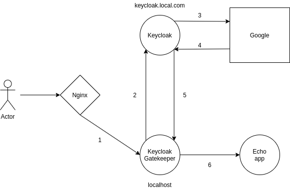
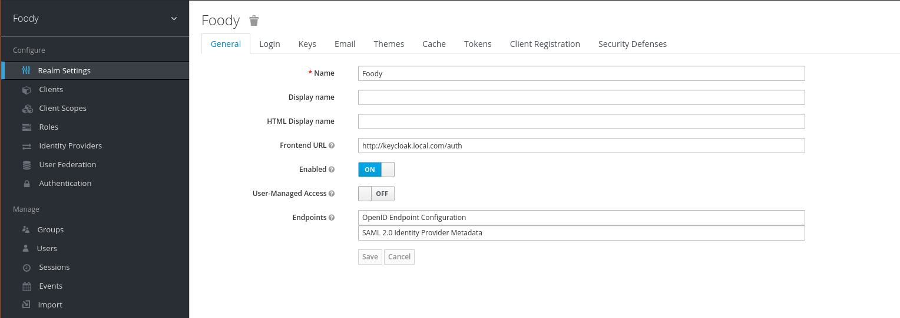
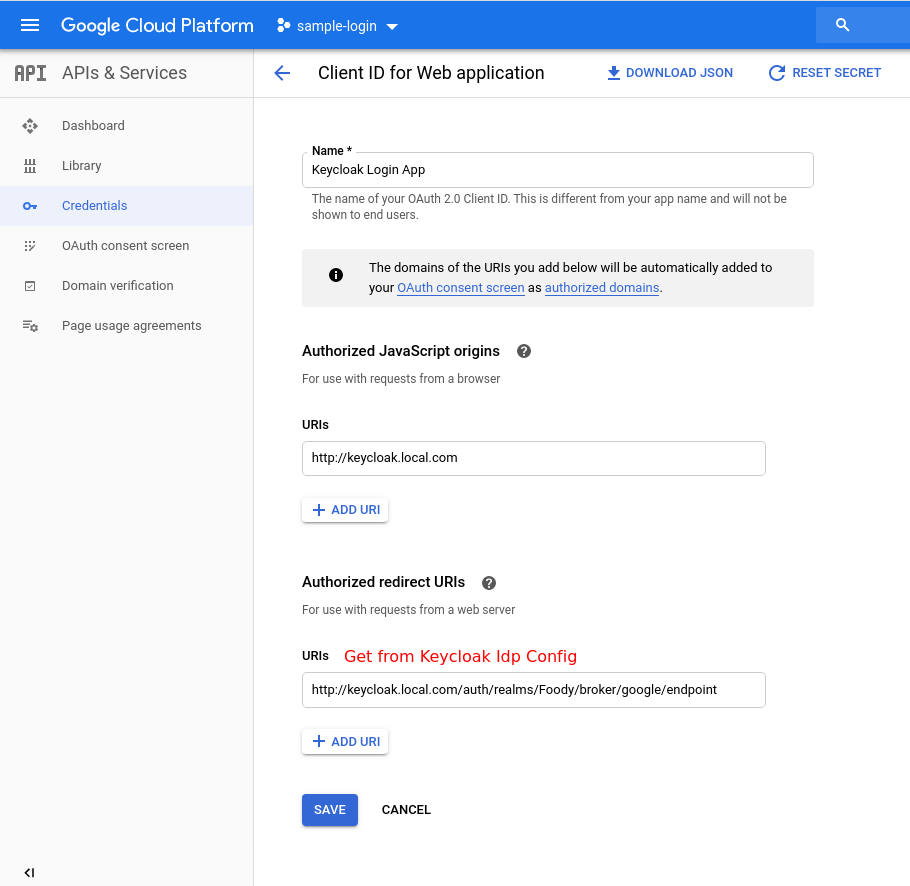
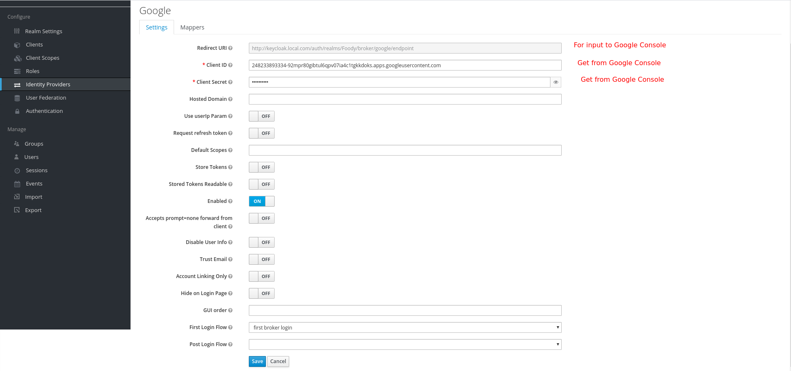
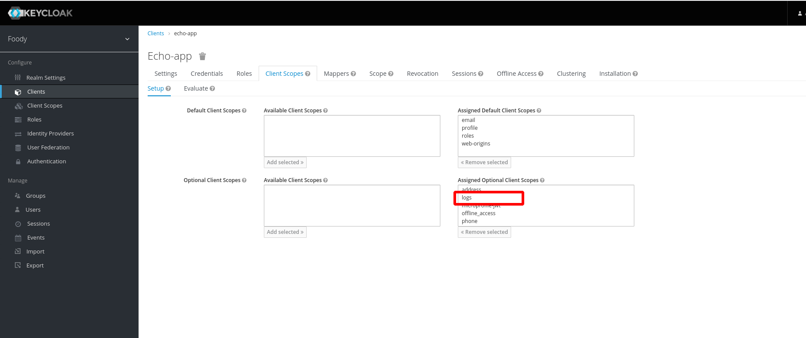

# Keycloak tutorial

### Bootstrap

Edit `start.sh` and replace connecting network interface. Then run

```sh
./start.sh
```

### Flow



1. User enter `localhost` for accessing Echo app
  1.1. Nginx forwarding request to Keycloak Gatekeeper
2. Keycloak Gatekeeper check for Client cookie to see if it login.
  2.1. Gatekeeper forward client to Keycloak Idp if not login
3. Keycloak Idp forward client to Google
4. Google return client back to Keycloak
  4.1. Keycloak check if user is new or not. If new user then register client as Keycloak user ([first broker login flow](https://github.com/keycloak/keycloak-documentation/blob/master/server_admin/topics/identity-broker/first-login-flow.adoc))
5. Keycloak return client back to Gatekeeper
  5.1. Gatekeeper check for scopes, groups, ACL, ...
  5.2. Gatekeeper set necessary cookie
6. Gatekeeper proxy request to upstreap app

### Getting started

#### Prepare environment

- Set `/etc/hosts` with entry `127.0.0.1 keycloak.local.com`
  - Because keycloak gatekeeper need a public way to access keycloak.
- Modify docker-compose with appropriate DNS if does not use `keycloak.local.com`

#### Social login

- Adding 1 new Realm
  - Setting Realm frontend URL as `http://keycloak.local.com/auth`



- Adding Identity Provider (Google)




- Adding 1 new Client:
  - Each client represent an app that will integrate with Keycloak. For example: logs, k8s dashboard, moltres, .... So you need to create a difference client for each app
  - You might set Client `Root URL` and `Base URL` as desire app (for example echo app). This might be used as redirect URL after login.

- Changing `Client/Access Type` to `confidential` then Save
  - `Credentials` tab will appear after saved
  - Take note of Client Id and Secret in Credentials tab

- Follow the example config of Keycloak Gatekeeper

#### ACL

- Role: usually represent an ability to access something, priviledges, ...
  - Realm role: global role. For example: test-accessible, qa-accessible,...
  - Client role: client specific role. For example: logs:viewer, k8s:dashboard,...
- Group: usually represent a group of user
- We usually create a group of user and attach roles to user group


### Previous issues

#### Keycloak failed to connect MySQL

- Need to add environment `JDBC_PARAMS: "useSSL=false"`

#### Keycloak behind a proxy

- Need to add 2 environment variable:
  - `KEYCLOAK_FRONTEND_URL`: pointing to public entry of keycloak (in this case the public DNS/port of the proxy)
  - `PROXY_ADDRESS_FORWARDING`: need to be set to true

#### Keycloak IdP no access token

- Because of invalid scopes setting on Keycloak Gatekeeper

#### Client id and audience not match

- https://stackoverflow.com/questions/53550321/keycloak-gatekeeper-aud-claim-and-client-id-do-not-match

#### Cannot request client scopes

- Add client scopes as `Optional Client Scopes` in Client setting


